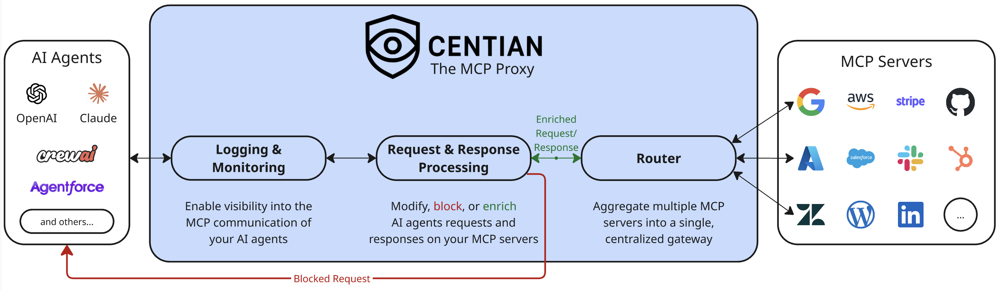

# Centian - the MCP Proxy

Centian is a lightweight MCP ([Model Context Protocol](https://modelcontextprotocol.io/)) proxy that adds **processing hooks**, **gateway aggregation**, and **structured logging** to MCP server traffic.

<p align="center">
  
</p>


## Highlights

- **Programmable MCP traffic processing** – inspect, modify, block, or enrich requests and responses with processor scripts.
- **Unified gateway for multiple servers** – expose many downstream MCP servers through one clean endpoint (DRY config).
- **Structured logging & visibility** – capture MCP events for debugging, auditing, and analysis.
- **Fast setup via auto‑discovery** – import existing MCP configs from common tools to get started quickly.

## Quick Start

1) **Install**

```bash
curl -fsSL https://raw.githubusercontent.com/T4cceptor/centian/main/scripts/install.sh | bash
```

2) **Initialize quickstart config (npx required)**

```bash
centian init -q
```

This does the following:
* Creates centian config at `~/.centian/config.json`
* Adds the `@modelcontextprotocol/server-sequential-thinking` MCP server to the config
* You can add more MCP servers by running `centian server add`:
    
    ```
    centian server add --name "my-local-memory" --command "npx" --args "-y,@modelcontextprotocol/server-memory"

    centian server add --name "my-deepwiki" --url "https://mcp.deepwiki.com/mcp"
    ```
* Creates an API key to authenticate at the centian proxy
* Displays MCP client configurations including API key header
    * NOTE: the API key is only shown ONCE, afterwards its hashed, so be sure to copy it here
    * Alernatively you can create another API key using `centian auth new-key`

3) **Start the proxy**

```bash
centian start
```

Default bind: `127.0.0.1:8080`.

> **Security note**
> Binding to `0.0.0.0` is allowed only if `auth` is explicitly set in the config (true or false). This is enforced to reduce accidental exposure.

4) **Point your MCP client to Centian**

Copy the provided config json into your MCP client/AI agent settings, and start the agent.

Example:
```json
{
  "mcpServers": {
    "centian-default": {
      "url": "http://127.0.0.1:8080/mcp/default",
      "headers": {
        "X-Centian-Auth": "<your-api-key>"
      }
    }
  }
}
```

5) **Done!** - you can now log and process all MCP requests proxied by centian.
    - (Optional): to process requests and responses by downstream MCPs, add a new processor via `centian processor new` and follow the instructions.


## Configuration

Centian uses a single JSON config at `~/.centian/config.json`.

Minimal example:

```json
{
  "name": "Centian Server",
  "version": "1.0.0",
  "auth": true,
  "authHeader": "X-Centian-Auth",
  "proxy": {
    "host": "127.0.0.1",
    "port": "8080",
    "timeout": 30,
    "logLevel": "info"
  },
  "gateways": {
    "default": {
      "mcpServers": {
        "my-server": {
          "url": "https://example.com/mcp",
          "headers": {
            "Authorization": "Bearer <token>"
          },
          "enabled": true
        }
      }
    }
  },
  "processors": []
}
```

### Endpoints

- Aggregated gateway endpoint:
  - `http://127.0.0.1:8080/mcp/<gateway>`
- Individual server endpoint:
  - `http://127.0.0.1:8080/mcp/<gateway>/<server>`

In aggregated mode, tools are namespaced to avoid collisions.

## Processors

Processors let you enforce policies or transform MCP traffic (request/response). You can scaffold a processor with:

```bash
centian processor new
```

The scaffold can optionally add the processor to your config automatically.

## Logging

Centian logs MCP activity to `~/.centian/logs/`:

- `requests.jsonl` – MCP requests with timestamps and session IDs

## Commands (Quick Reference)

- `centian init` – initialize config
- `centian start` – start the proxy
- `centian auth new-key` – generate API key
- `centian server ...` – manage MCP servers
- `centian config ...` – manage config
- `centian logs` – view recent logs

## Installation (More Options)

### Script (recommended)

```bash
curl -fsSL https://raw.githubusercontent.com/T4cceptor/centian/main/scripts/install.sh | bash
```

### Homebrew

Coming soon.

### From source

```bash
git clone https://github.com/T4cceptor/centian.git
cd centian
go build -o build/centian ./cmd/main.go
```

## Troubleshooting & Known Limitations

### Known Limitations
- stdio servers run locally: Stdio MCP servers run on the host under the same user context as Centian. Only configure stdio servers if you trust the clients using Centian, since they can access local resources through those servers. For the future, we are looking into starting stdio-based servers in a virtualized environment.
- OAuth not yet supported: Centian does not support OAuth (upstream or downstream) in v0.1. You can use headers for auth; client‑provided headers are forwarded, proxy‑configured headers can override them.
- Shared credentials reduce auditability: If you set auth headers at the proxy level, all downstream requests share the same identity. Prefer per‑client credentials so downstream servers can audit and rate‑limit correctly, or provide appropriate processors and logging to ensure auditability.
- Future changes: please be aware that the APIs and especially data structures we are using to log events and provide information to processors are still evolving and might change in the future, especially before version 1.0.0. Further, changes in MCP are reflected by the MCP Go SDK and are dependent on it.

## Development

```bash
make build          # Build to build/centian
make install        # Install to ~/.local/bin/centian
make test-all       # Run unit + integration tests
make test-coverage  # Runs test coverage report
make lint           # Run linting
make dev            # Clean, fmt, vet, test, build
```

## License

Apache-2.0
