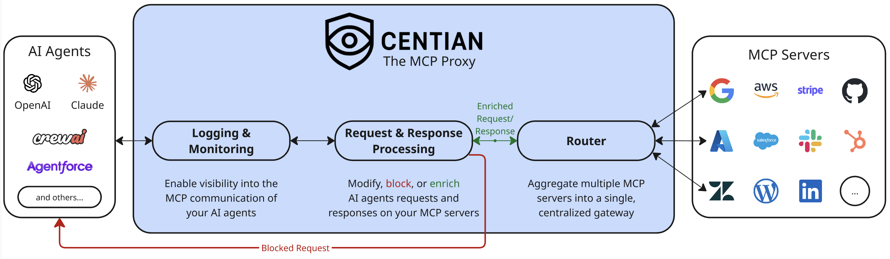

# Centian - the MCP Proxy

Centian is a lightweight MCP ([Model Context Protocol](https://modelcontextprotocol.io/)) proxy that adds **processing hooks**, **gateway aggregation**, and **structured logging** to MCP server traffic.

<p align="center">
  
</p>


## Highlights

- **Programmable MCP traffic processing** – inspect, modify, block, or enrich requests and responses with processor scripts.
- **Unified gateway for multiple servers** – expose many downstream MCP servers through one clean endpoint (DRY config).
- **Structured logging & visibility** – capture MCP events for debugging, auditing, and analysis.
- **Fast setup via auto‑discovery** – import existing MCP configs from common tools to get started quickly.

## Quick Start

Note: if you do not already have a MCP setup locally you can also look into the next section Demo.

1) **Install**

```bash
curl -fsSL https://raw.githubusercontent.com/T4cceptor/centian/main/scripts/install.sh | bash
```

2) **Initialize quickstart config (npx required)**

```bash
centian init -q
```

This does the following:
* Creates centian config at `~/.centian/config.json`
* Adds the `@modelcontextprotocol/server-sequential-thinking` MCP server to the config
* You can add more MCP servers by running `centian server add`:
    
    ```
    centian server add --name "my-local-memory" --command "npx" --args "-y,@modelcontextprotocol/server-memory"

    centian server add --name "my-deepwiki" --url "https://mcp.deepwiki.com/mcp"
    ```
* Creates an API key to authenticate at the centian proxy
* Displays MCP client configurations including API key header
    * NOTE: the API key is only shown ONCE, afterwards its hashed, so be sure to copy it here
    * Alernatively you can create another API key using `centian auth new-key`

3) **Start the proxy**

```bash
centian start
```

Default bind: `127.0.0.1:8080`.

> **Security note**
> Binding to `0.0.0.0` is allowed only if `auth` is explicitly set in the config (true or false). This is enforced to reduce accidental exposure.

4) **Point your MCP client to Centian**

Copy the provided config json into your MCP client/AI agent settings, and start the agent.

Example:
```json
{
  "mcpServers": {
    "centian-default": {
      "url": "http://127.0.0.1:8080/mcp/default",
      "headers": {
        "X-Centian-Auth": "<your-api-key>"
      }
    }
  }
}
```

5) **Done!** - you can now log and process all MCP requests proxied by centian.
    - (Optional): to process requests and responses by downstream MCPs, add a new processor via `centian processor new` and follow the instructions.


## Demo

The `demo/` folder contains two isolated walkthroughs:
- `demo/logging_demo/` for OpenTelemetry span export on MCP tool calls.
- `demo/modification_demo/` for regex-based redaction of sensitive response values.

Quick local setup:

```bash
cd demo
make setup
```

Then run either `make demo-logging-up` or `make demo-modification-up`.

These examples are intended to demonstrate extension patterns and are not production-hardened security/monitoring implementations.

For further details, checkout `demo/README.md`.


## Configuration

Centian uses a single JSON config at `~/.centian/config.json`.

Minimal example:

```json
{
  "name": "Centian Server",
  "version": "1.0.0",
  "auth": true,
  "authHeader": "X-Centian-Auth",
  "proxy": {
    "host": "127.0.0.1",
    "port": "8080",
    "timeout": 30,
    "logLevel": "info",
    "logOutput": "file",
    "logFile": "~/.centian/centian.log"
  },
  "gateways": {
    "default": {
      "mcpServers": {
        "my-server": {
          "url": "https://example.com/mcp",
          "headers": {
            "Authorization": "Bearer <token>"
          },
          "enabled": true
        }
      }
    }
  },
  "processors": []
}
```

### Valid Configuration Requirements

At a minimum (for config management commands), a config must include:

- `version` (non-empty string)
- `proxy` (object)

For `centian start` (strict validation), the config must also include:

- At least one gateway in `gateways`
- Each gateway must have at least one active MCP server
- Gateway names and server names must be URL-safe (`a-z`, `A-Z`, `0-9`, `_`, `-`)
- Each server must define exactly one transport:
  - `command` for stdio, or
  - `url` for HTTP(S)
- If `url` is used, it must be a valid `http://` or `https://` URL
- Header keys and values must be non-empty

You can validate your current config with:

```bash
centian config validate
```

### Environment Variable Interpolation

Centian supports environment variable interpolation in `mcpServers.<server>.headers` values.

Example:
```json
{
  "gateways": {
    "default": {
      "mcpServers": {
        "github": {
          "url": "https://api.githubcopilot.com/mcp/",
          "headers": {
            "Authorization": "Bearer ${GITHUB_PAT}",
            "X-Api-Key": "$API_KEY",
            "X-Custom": "prefix-${ENV}-suffix"
          }
        }
      }
    }
  }
}
```

### Endpoints

- Aggregated gateway endpoint: `http://localhost:8080/mcp/<gateway>`
- Individual server endpoint: `http://localhost:8080/mcp/<gateway>/<server>`

In aggregated mode, tools are namespaced to avoid collisions.

## Session Management

Centian manages two different session layers:

- **Upstream sessions** are the sessions between an MCP client and Centian.
- **Downstream sessions** are the sessions Centian opens to the configured MCP servers behind a gateway.

These two layers are intentionally managed separately. An upstream session still exists per MCP client session, but the downstream connections attached to it can be reused from a pool.

### Current Behavior

- If `auth` is `true`, Centian identifies the caller by the matched API key ID.
- If `auth` is `false`, Centian uses one shared local identity per endpoint.
- Downstream session reuse is keyed by `endpoint + identity`.

This means:

- Reconnects from the same authenticated client reuse the same downstream MCP session set for that endpoint.
- Unauthenticated local traffic shares one downstream MCP session set per endpoint.
- Different endpoints do not share downstream sessions with each other.

### Why This Exists

Some MCP clients reconnect frequently or do not reliably reuse `Mcp-Session-Id`. If downstream sessions were tied directly to every upstream reconnect, Centian would repeatedly re-initialize downstream MCP servers.

The current pooling model avoids that by keeping upstream session handling separate from downstream session ownership:

- the upstream session keeps references to downstream connections
- the pool owns downstream lifecycle and reuse

This applies to both stateful and stateless upstream MCP traffic. Even if the upstream side is stateless, Centian can still reuse downstream sessions internally when the identity and endpoint match.


## Processors

Processors let you enforce policies or transform MCP traffic (request/response). You can scaffold a processor with:

```bash
centian processor new
```

The scaffold can optionally add the processor to your config automatically.

## Logging

Centian has two different logging/observability paths, and they serve different purposes.

### Internal Proxy Logging

These logs are for Centian's own internal runtime behavior only: proxy startup, downstream connection state, processor execution failures, and similar implementation details.

Configure them under `proxy`:

```json
{
  "proxy": {
    "logLevel": "info",
    "logOutput": "file",
    "logFile": "~/.centian/centian.log"
  }
}
```

- `logLevel`: `debug`, `info`, `warn`, `error`
- `logOutput`: `file`, `console`, `both`
- `logFile`: optional file path when file output is enabled

By default, internal proxy logs are written to `~/.centian/centian.log`.

### MCP Communication Logging

Logs about actual MCP requests/responses are separate from the internal logger. They are written to `~/.centian/logs/` as MCP event records:

- `requests.jsonl` – MCP requests with timestamps and session IDs

Use this path when you want to inspect or retain MCP traffic.

### Processor-Based Observability

If you want to log, export, redact, or otherwise process MCP communication details, use processors rather than the internal proxy logger. This is the correct place for request/response-specific observability, audit enrichment, and custom telemetry.

See:

- [demo/README.md](demo/README.md) for end-to-end examples
- `demo/src/otel_span_logger.py` for telemetry export
- `demo/src/response_redactor.py` for response transformation/redaction

## Commands (Quick Reference)

- `centian init` – initialize config
- `centian start` – start the proxy
- `centian auth new-key` – generate API key
- `centian server ...` – manage MCP servers
- `centian config ...` – manage config
- `centian logs` – view recent logs

## Installation (More Options)

### Script (recommended)

```bash
curl -fsSL https://raw.githubusercontent.com/T4cceptor/centian/main/scripts/install.sh | bash
```

### Homebrew

Coming soon.

### From source

```bash
git clone https://github.com/T4cceptor/centian.git
cd centian
go build -o build/centian ./cmd/main.go
```

## Troubleshooting & Known Limitations

### Known Limitations
- stdio servers run locally: Stdio MCP servers run on the host under the same user context as Centian. Only configure stdio servers if you trust the clients using Centian, since they can access local resources through those servers. For the future, we are looking into starting stdio-based servers in a virtualized environment.
- OAuth not yet supported: Centian does not support OAuth (upstream or downstream) in v0.1. You can use headers for auth; client‑provided headers are forwarded, proxy‑configured headers can override them.
- Shared credentials reduce auditability: If you set auth headers at the proxy level, all downstream requests share the same identity. Prefer per‑client credentials so downstream servers can audit and rate‑limit correctly, or provide appropriate processors and logging to ensure auditability.
- Future changes: please be aware that the APIs and especially data structures we are using to log events and provide information to processors are still evolving and might change in the future, especially before version 1.0.0. Further, changes in MCP are reflected by the MCP Go SDK and are dependent on it.

## Development

```bash
make build          # Build to build/centian
make install        # Install to ~/.local/bin/centian
make test-all       # Run unit + integration tests
make test-coverage  # Runs test coverage report
make lint           # Run linting
make dev            # Clean, fmt, vet, test, build
```

## License

Apache-2.0
