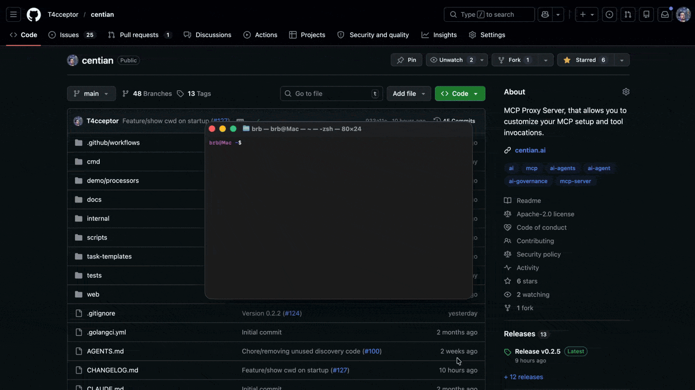
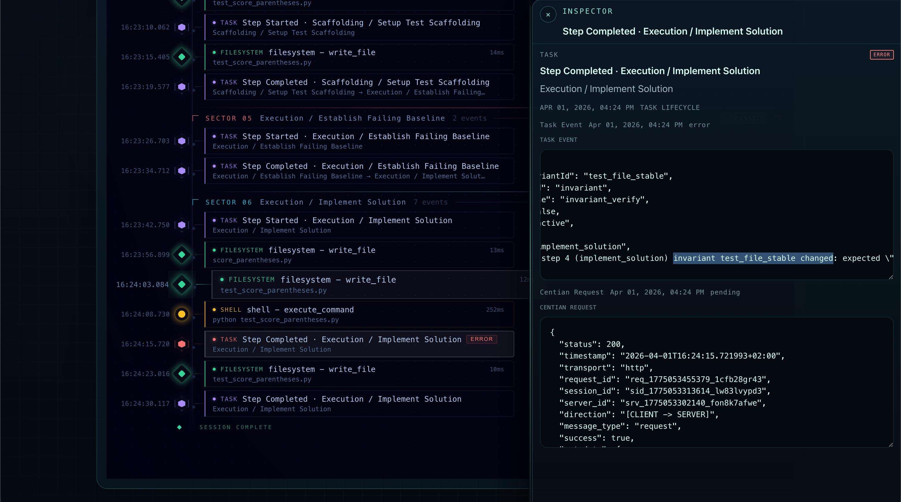

# Centian

[](https://github.com/T4cceptor/centian/releases)
[](https://github.com/T4cceptor/centian/actions/workflows/ci.yml)
[](./LICENSE)


**Control plane for AI agents** — enforce structured workflows, govern tool access, and inspect every action your agent takes.

<div align="center">
  
</div>
<br>

Centian sits between your AI agents and their MCP servers. All tool calls flow through Centian's proxy, giving you a single point of control for aggregation, middleware processing, workflow enforcement, and full observability.

---

## The Problem

AI agents calling MCP tools today operate with:

- **No structure.** The agent decides what to do based on prompt text alone. There's no contract, no phased workflow, no verification that it followed a process.
- **No visibility.** You see the final output, but not the 47 tool calls the agent made along the way — or the 3 it shouldn't have made.
- **No enforcement.** You can't restrict which tools an agent uses during which phase of work, or block a tool call that violates policy.
- **Config sprawl.** Every MCP client needs separate configuration for every MCP server. Adding a server means updating every client.

Centian solves all four.

---

## Quick Start

### Install

```bash
curl -fsSL https://raw.githubusercontent.com/T4cceptor/centian/main/scripts/install.sh | bash
```

For all install methods see [Installation Options](#installation-options).

### Local Demo

The demo showcases centian as the agent control plane within a familiar setting: test-driven development.
The agent is given a task to implement `score_paranthesis` - see [prompt](internal/agentrunner/assets/prompt.md) - and is then guided through the task using centian. All actions are visualized for you in a web-based UI - allowing you to monitor what exactly the agent is doing.

**Prerequisites**: Before running `centian demo`, make sure you have:

- `node` (tested with `v24.2.0`) and `npx` (tested with `11.3.0`) available on your `PATH` - required to launch filesystem and shell MCP servers, and run tests
- Claude Code, Gemini CLI, or OpenAI Codex installed and authenticated - Centian launches the selected agent in headless mode through its local CLI, so the demo will fail if that agent binary is missing or it's not signed in.

**Claude Code** (sonnet)
```bash
centian demo -a claude
```

**Gemini CLI** (gemini-2.5-flash)
```bash
centian demo -a gemini
```

**Codex:** (using default option)
```bash
centian demo -a codex
```
Note: for the codex demo centian will copy (and later cleanup) existing auth material for the OpenAI API.

**What the demo does**
- Setup environment: create a local folder `.centian/demo`, copying required artifacts there (see [here](internal/agentrunner/assets)), adjusting configs.
- Start Centian server locally at an available port (selected automatically).
- Start selected coding agent in headless mode with [prompt](internal/agentrunner/assets/prompt.md).
- The Centian UI is opened in a new browser window showing the task overview page UI - once the agent registers the task at Centian you can check what the agent is doing by clicking on it and observing the MCP events.
- After the agent is done the CLI will prompt you if you want to close the server. Feel free to do so, you can run the demo multiple times, also with different agents - previous runs will be preserved.

**Note:** the demo is intended to showcase Centian's capabilities and get a first impression, it is NOT a production-grade setup (e.g. `auth = false`, using `127.0.0.1`). If you want to use Centian do NOT copy-paste or reference the created config, check out [Configuration](#configuration) for how to setup your own centian proxy.

### Using `init` for basic proxy setup (no task verification)

```bash
# 1. Install
curl -fsSL https://raw.githubusercontent.com/T4cceptor/centian/main/scripts/install.sh | bash

# 2. Initialize with a starter MCP server
centian init -q
# Optional: check created config at ~/.centian/config.json

# 3. Add your own MCP servers
centian server add --name "filesystem" --command "npx" --args "-y,@modelcontextprotocol/server-filesystem,/path/to/project"
centian server add --name "deepwiki" --url "https://mcp.deepwiki.com/mcp"

# 4. Start the proxy
centian start

# 5. Point your MCP client at Centian (use the config shown during init)
```

### With task verification

Add capabilities to your config at `~/.centian/config.json`. In the flat layout, capabilities go under `proxy`; in the project-based layout, they go on each project:

```json
{
  "proxy": {
    "capabilities": {
      "taskVerification": {
        "enabled": true,
        "templatesPath": "/path/to/task-templates"
      },
      "eventStorage": {
        "enabled": true,
        "driver": "sqlite"
      },
      "ui": {
        "enabled": true
      }
    }
  }
}
```

Note: by default task-templates/integrated are automatically integrated in centian, but can/will be overwritten by templates using the same task.id

Start Centian and open the UI:

```bash
centian start
# UI available at http://localhost:9666/ui/tasks
```

The agent now has access to `centian.task_*` tools alongside your normal MCP tools. The task lifecycle:

1. `centian.task_list_templates` — discover available workflow templates
2. `centian.task_register` — start a task run from a template
3. `centian.task_complete_onboarding` — submit project context
4. `centian.task_complete_planning` — freeze the execution contract
5. `centian.task_start_step` / `centian.task_complete_step` — execute with verification
6. `centian.task_fail` / `centian.task_restart` — handle failures

---


## How It Works

### 1. One gateway, all your MCP servers

Configure your MCP servers once in Centian. Point every client at `localhost:9666`. Tool namespacing (`<server>_<tool>`) eliminates collisions automatically.

```json
{
  "gateways": {
    "default": {
      "mcpServers": {
        "filesystem": { "command": "npx", "args": ["-y", "@modelcontextprotocol/server-filesystem", "/path/to/project"] },
        "github": { "url": "https://api.github.com/mcp", "headers": { "Authorization": "Bearer <token>" } }
      }
    }
  }
}
```

Every client connects to one endpoint:

```json
{
  "mcpServers": {
    "centian": {
      "url": "http://127.0.0.1:9666/mcp/default",
      "headers": { "X-Centian-Auth": "<your-api-key>" }
    }
  }
}
```

### 2. Programmable middleware for tool calls

Processors intercept every tool call before and after execution. They receive the full request/response context, can modify payloads, and can abort the chain.

Use cases:
- Audit logging every tool call to a database
- Rate limiting calls that exceed thresholds
- Stripping secrets or environment variables from tool arguments
- Redacting PII from responses
- Enforcing allow-lists for which tools an agent can call

Scaffold a new processor:

```bash
centian processor new
```

### 3. Structured task verification



This is what makes Centian a control plane, not just a proxy.

Task verification lets you define **declarative workflow templates** in YAML. Each template describes a structured lifecycle — onboarding, planning, scaffolding, execution — with preconditions, postconditions, invariants, and per-phase tool permissions.

When an agent registers a task from a template:

1. **Onboarding** — the agent gathers project context and constraints
2. **Planning** — the agent proposes an approach, which gets **frozen into an execution contract**
3. **Execution** — the agent works through defined steps, with Centian verifying correctness at each gate
4. **Completion** — postconditions confirm the task was done right

The frozen execution contract is key: once planning completes, the agent reads from an immutable contract rather than mutable prompt context. You can prove what the agent committed to doing, and verify whether it actually did it.

**Per-phase tool governance:** each workflow node can declare which MCP tools the agent is allowed to call. During an approval-wait phase, all downstream tools are blocked. During scaffolding, you might allow filesystem access but block shell commands.

### 4. Full observability

Every MCP tool call is captured with timestamps, session IDs, request/response payloads, and — when task verification is active — the workflow context that produced it.

Without task verification, Centian logs events via structured JSONL and a queryable SQLite event store. With task verification enabled, Centian serves an embedded UI that shows agent activity **in the context of what the agent was supposed to be doing**:

- Timeline grouped by workflow phase
- Tool calls correlated to task steps
- Failed postcondition checks with detailed failure metadata
- Full request/response inspection

```bash
# CLI log access
centian logs

# Embedded UI (when task verification + UI are enabled)
# http://localhost:9666/ui/tasks
```

---

## Documentation

The deep documentation lives under [`docs/`](docs/README.md).

- [Getting Started](docs/getting_started.md)
- [Configuration Reference](docs/configuration_reference.md)
- [Processor Development](docs/processor_development_guide.md)
- [Task Template Authoring](docs/task-template-authoring.md)
- [Taskverification Runtime](docs/TASKVERIFICATION.md)
- [MCP Proxy Best Practices](docs/mcp_proxy_best_practices.md)

## Task Templates

Templates are YAML files that define structured agent workflows. Each template specifies:

- **Required parameters** the agent must provide at registration
- **Onboarding requirements** — what context the agent needs to gather
- **Planning requirements** — what the agent must define before execution begins
- **Workflow nodes** — scaffolding, execution, and approval-wait phases
- **Tool allowlists** — which MCP tools are permitted in each phase
- **Preconditions and postconditions** — verification checks at each step boundary
- **Invariants** — conditions that must hold throughout execution

Example templates for TDD workflows are included in the repository under `task-templates/`.

The template schema is documented and designed for extensibility. Community contributions of templates for common workflows are welcome — see [CONTRIBUTING.md](CONTRIBUTING.md).

---

## Configuration

Centian uses a single JSON config at `~/.centian/config.json`. The config supports two layouts:

**Flat layout** (default from `centian init`) — gateways, auth, and capabilities live at the top level:

```json
{
  "name": "Centian Server",
  "version": "1.0.0",
  "auth": true,
  "authHeader": "X-Centian-Auth",
  "proxy": {
    "host": "127.0.0.1",
    "port": "9666",
    "timeout": 30,
    "logLevel": "info",
    "capabilities": {
      "taskVerification": { "enabled": false },
      "eventStorage": { "enabled": true, "driver": "sqlite" },
      "ui": { "enabled": false }
    }
  },
  "gateways": {
    "default": {
      "mcpServers": {
        "my-server": {
          "url": "https://example.com/mcp",
          "headers": { "Authorization": "Bearer <token>" },
          "enabled": true
        }
      }
    }
  },
  "processors": []
}
```

**Project-based layout** — for isolating multiple workloads with separate databases, feature flags, and route prefixes:

```json
{
  "name": "Centian Server",
  "version": "1.0.0",
  "proxy": {
    "host": "127.0.0.1",
    "port": "9666",
    "timeout": 30
  },
  "projects": {
    "team-alpha": {
      "auth": true,
      "capabilities": {
        "taskVerification": { "enabled": true },
        "eventStorage": { "enabled": true },
        "ui": { "enabled": true }
      },
      "gateways": {
        "workbench": {
          "mcpServers": {
            "filesystem": { "command": "npx", "args": ["-y", "@modelcontextprotocol/server-filesystem", "/workspace"] }
          }
        }
      }
    }
  }
}
```

Each project gets its own SQLite database (`~/.centian/projects/<slug>/events.sqlite`) and its own route prefix. The flat layout is auto-migrated to a `"default"` project at runtime, so existing configs continue to work unchanged.

### Endpoints

- Aggregated gateway: `http://127.0.0.1:9666/mcp/<gateway>`
- Individual server: `http://127.0.0.1:9666/mcp/<gateway>/<server>`
- Project-scoped gateway: `http://127.0.0.1:9666/<project>/<mcp>/<gateway>`
- Project-scoped UI: `http://127.0.0.1:9666/<project>/ui`

In aggregated mode, tools are namespaced to avoid collisions. The `"default"` project uses unprefixed routes for backwards compatibility.

### Security

Binding to `0.0.0.0` is only allowed if `auth` is explicitly configured in every project. This prevents accidental exposure.

---

## Commands

| Command | Description |
|---------|-------------|
| `centian init` | Initialize config (use `-q` for quickstart) |
| `centian start` | Start the proxy |
| `centian auth new-key` | Generate a new API key |
| `centian server add` | Add an MCP server |
| `centian server ...` | Manage MCP servers |
| `centian config ...` | Manage configuration |
| `centian processor new` | Scaffold a new processor |
| `centian logs` | View recent MCP logs |

---

## Installation Options

| Method | Platform | Full UI | Command |
|--------|----------|---------|---------|
| Shell script | Linux, macOS | ✓ | `curl -fsSL .../install.sh \| bash` |
| Release binary | Linux, macOS, Windows | ✓ | Download from [releases](https://github.com/T4cceptor/centian/releases) |
| `go install` | Any | ✗ | `go install github.com/T4cceptor/centian@latest` |
| Docker | Linux, macOS, Windows | ✓ | `docker run t4ce/centian:latest` |
| Homebrew | — | — | Planned |

### Shell script (recommended)

```bash
curl -fsSL https://raw.githubusercontent.com/T4cceptor/centian/main/scripts/install.sh | bash
```

Supports `--version` and `--install-dir` flags. Installs to `~/.local/bin` by default.

### Release binaries

Download the appropriate archive from the [latest release](https://github.com/T4cceptor/centian/releases/latest), extract it, and place `centian` on your `PATH`.

### `go install`

```bash
go install github.com/T4cceptor/centian@latest
```

Requires Go 1.25+. Builds without the embedded web UI — use a release binary or Docker for the full UI.

### Docker

```bash
# Full image (Linux, macOS, Windows)
docker run --rm -p 9666:9666 t4ce/centian:latest

# Alpine image
docker run --rm -p 9666:9666 t4ce/centian:latest-alpine
```

### Homebrew

Homebrew support is planned.

---

## Current Status

Centian is usable and actively developed, but it's pre-1.0 with deliberate gaps. We're transparent about what works and what doesn't yet.

**Working today:**
- MCP proxy with gateway aggregation and tool namespacing
- Project-based isolation: per-project databases, route prefixes, capabilities, and auth (multi-tenancy preparation)
- Programmable processor chain (CLI and webhook)
- Task verification with template-based workflows, frozen execution contracts, and per-phase tool governance
- SQLite event persistence with task/action correlation
- Embedded read-only UI for task run inspection
- Structured JSONL request logging
- Auto-discovery of existing MCP configs (`centian init -p <path>`)
- API key authentication with per-gateway and per-project scoping

**Known limitations:**
- Task run state is in-memory only (not restorable after restart)
- Governance is tool-level, not semantic (no read vs. write distinction within a tool)
- SQLite is the only storage backend (Postgres planned)
- OAuth support or downstream MCP servers is limited, not all flows are supported yet
- The UI is read-only (no task control actions from the UI yet)
- Approval-wait phases block tools but have no dedicated approve/resume mechanism yet

APIs and data structures may change before v1.0, particularly the processor interface and event schemas.

---

## Development

```bash
make build          # Build to build/centian
make install        # Install to ~/.local/bin/centian
make test-all       # Run unit + integration tests
make test-coverage  # Test coverage report
make lint           # Run linting
make dev            # Clean, fmt, vet, test, build
```

---

## Why "Control Plane"?

MCP proxies route traffic. Centian governs it.

The proxy is the mechanism — it's how Centian sees and controls every tool call. But the point isn't routing. The point is knowing what your agent is doing, constraining what it's allowed to do, and verifying that it did what you asked.

If you're using AI agents in environments where process matters — regulated industries, mission-critical workflows, or anywhere you need to answer "what did the agent do and why?" — that's what Centian is for.

---

## License

Apache-2.0
