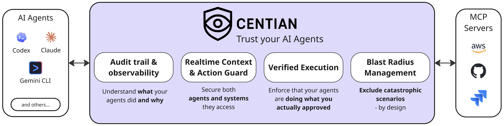

<h1 align="center">Centian</h1>
<div align="center">

[](https://github.com/T4cceptor/centian/releases)
[](https://github.com/T4cceptor/centian/actions/workflows/ci.yml)
[](./LICENSE)

</div>

<div style="font-size: 12pt">

**Trust your AI Agents**: See what your AI agents do. Control what they're allowed to do. Verify they did what you approved — before, during, and after every task.

</div>

Keep your systems safe from what your agents might do. Keep your agents safe from what the world throws at them. Built for the engineers who put agents into production and answer for what they do.

<p align="center">
  
</p>

## Why Centian exists
Your AI Agents touch the filesystem, your APIs, your databases. They make decisions you can't always predict and take actions you can't always undo. And any new agent adds another thing to worry about at 2 am.

You're probably in the right place if any of these thoughts sound familiar:
- "I want to deploy agents in production but I can't justify the risk yet."
- "I have agents running and I'm not sure I'd notice if one of them did something wrong."
- "Compliance asked how we audit AI decisions and I don't have a clean answer."
- "Our automation already deleted a production database once. I'm not letting an agent near it without something in the way."

Centian is the layer that sits between your agents and the systems they touch — capturing every action, enforcing what they're allowed to do, and verifying they did what they committed to do.

## How Centian helps you
Centian gives you four things out of the box:

### 🔍 Audit trail & observability
Understand what your agents did — and why.
Every tool call, every parameter, every result is captured and correlated to the task that produced it. Inspect any session, replay any decision, answer "what happened?" without guessing.

### 🛡️ Realtime context & action guard
Secure both your agents and the systems they access.
Centian governs **what enters** the agent's context (untrusted inputs, prompt injection vectors) and **what leaves** it (destructive calls, sensitive data, unapproved tools) - **bidirectional, at runtime**.

### ✅ Verified execution
Confirm your agents are doing what you actually approved.
You define the workflow upfront. The agent commits to it as a frozen execution contract. Centian verifies each step against that contract — and handles deviations in real time.

### 💥 Blast radius management
Exclude catastrophic scenarios by design.
Per-phase tool allowlists, irreversible-action gating, and approval-wait phases mean dangerous tools are simply unavailable when they're not needed — not just "we hope the agent won't call them."

Centian gives you the runtime visibility and enforcement you need to catch failures fast, prove what happened, and constrain what's possible.


## Getting started

### Install

```bash
curl -fsSL https://raw.githubusercontent.com/T4cceptor/centian/main/scripts/install.sh | bash
```

For all install methods see [Installation Options](#installation-options).

### Demo
```bash
centian demo
```

This starts a local Centian server, loads the bundled IT Ops incident demo into
the event database immediately, and opens the task run list at `/ui/tasks`.

Use the demo for post-hoc analysis of a completed governed run:

✔ Prompt injection evidence is detected and redacted
✔ A disallowed operational tool call is blocked by process policy
✔ A failed quality gate is saved as a governance event
✔ The final run remains inspectable through the task detail UI

For more information about demos, including deprecated custom replay and
agent-based runs, see [`demo/README.md`](demo/README.md).

---

### Using `init` for basic proxy setup (without process verification)

```bash
# 1. Initialize with a starter MCP server
centian init -q
# Optional: check created config at ~/.centian/config.json

# 2. Add your own MCP servers
centian server add --name "filesystem" --command "npx" --args "-y,@modelcontextprotocol/server-filesystem,/path/to/project"
centian server add --name "deepwiki" --url "https://mcp.deepwiki.com/mcp"

# 3. Start the proxy
centian start

# 4. Point your MCP client at Centian (use the config shown during init)
```

### With process verification

Add capabilities to your config at `~/.centian/config.json`. In the flat layout, capabilities go under `proxy`; in the project-based layout, they go on each project:

```json
{
  "proxy": {
    "capabilities": {
      "taskVerification": {
        "enabled": true,
        "templatesPath": "/path/to/task-templates"
      },
      "eventStorage": {
        "enabled": true,
        "driver": "sqlite"
      },
      "ui": {
        "enabled": true
      }
    }
  }
}
```

Note: by default task-templates/integrated are automatically integrated in centian, but can/will be overwritten by templates using the same task.id

Start Centian and open the UI:

```bash
centian start
# UI available at http://localhost:9666/ui/tasks
```

## Documentation

The deep documentation lives under [`docs/`](docs/README.md).

- [Getting Started](docs/getting_started.md)
- [Configuration Reference](docs/configuration_reference.md)
- [Processor Development](docs/processor_development_guide.md)
- [Task Template Authoring](docs/task-template-authoring.md)
- [Taskverification Runtime](docs/TASKVERIFICATION.md)
- [MCP Proxy Best Practices](docs/mcp_proxy_best_practices.md)

## Installation Options

| Method | Platform | Full UI | Command |
|--------|----------|---------|---------|
| Shell script | Linux, macOS | ✓ | `curl -fsSL .../install.sh \| bash` |
| Release binary | Linux, macOS, Windows | ✓ | Download from [releases](https://github.com/T4cceptor/centian/releases) |
| `go install` | Any | ✗ | `go install github.com/T4cceptor/centian@latest` |
| Docker | Linux, macOS, Windows | ✓ | `docker run t4ce/centian:latest` |
| Homebrew | — | — | Planned |

### Shell script (recommended)

```bash
curl -fsSL https://raw.githubusercontent.com/T4cceptor/centian/main/scripts/install.sh | bash
```

Supports `--version` and `--install-dir` flags. Installs to `~/.local/bin` by default.

### Release binaries

Download the appropriate archive from the [latest release](https://github.com/T4cceptor/centian/releases/latest), extract it, and place `centian` on your `PATH`.

### `go install`

```bash
go install github.com/T4cceptor/centian@latest
```

Requires Go 1.25+. Builds without the embedded web UI — use a release binary or Docker for the full UI.

### Docker

```bash
# Full image (Linux, macOS, Windows)
docker run --rm -p 9666:9666 t4ce/centian:latest

# Alpine image
docker run --rm -p 9666:9666 t4ce/centian:latest-alpine
```

### Homebrew

Homebrew support is planned.

---

## Current Status

Centian is usable and actively developed, but it's pre-1.0 with deliberate gaps. We're transparent about what works and what doesn't yet.

**Working today:**
- MCP proxy with gateway aggregation and tool namespacing
- Project-based isolation: per-project databases, route prefixes, capabilities, and auth (multi-tenancy preparation)
- Programmable processor chain (CLI and webhook)
- Process verification with template-based workflows, frozen execution contracts, and per-phase tool governance
- SQLite event persistence with task/action correlation
- Embedded read-only UI for task run inspection
- Structured JSONL request logging
- Auto-discovery of existing MCP configs (`centian init -p <path>`)
- API key authentication with per-gateway and per-project scoping

**Known limitations:**
- Task run state is in-memory only (not restorable after restart)
- Governance is tool-level, not semantic (no read vs. write distinction within a tool)
- SQLite is the only storage backend (Postgres planned)
- OAuth support or downstream MCP servers is limited, not all flows are supported yet
- The UI is read-only (no task control actions from the UI yet)
- Approval-wait phases block tools but have no dedicated approve/resume mechanism yet

APIs and data structures may change before v1.0, particularly the processor interface and event schemas.

---

## Development

```bash
make build          # Build to build/centian
make install        # Install to ~/.local/bin/centian
make test-all       # Run unit + integration tests
make test-coverage  # Test coverage report
make lint           # Run linting
make dev            # Clean, fmt, vet, test, build
```

---

## License

Apache-2.0
