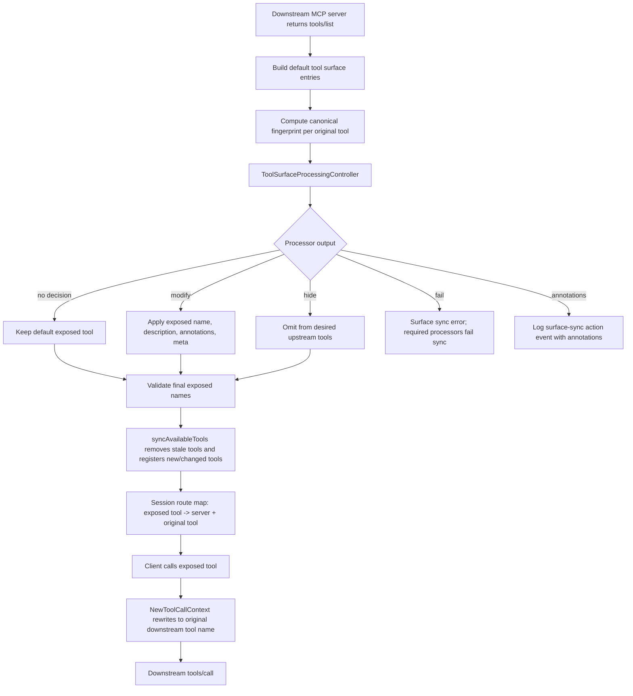

# Tool Surface Processor V1 - PR Support

## Reviewer Summary

This PR adds a registration-time processor part, `tool_surface`, so existing CLI, webhook, and builtin processors can modify the tool catalog before an upstream MCP client sees it.

The feature is intentionally scoped to tools only. It does not implement prompt, resource, or full MCP-surface processors yet; those part names are reserved so future work can extend the same idea without silently accepting inactive config.

What reviewers should verify first:

- `tool_surface` processors run during tool registration, not during `tools/call`.
- The normal tool-call processor path remains unchanged except that it now skips `tool_surface` processors.
- Renamed tools remain callable because Centian stores an exposed-name to original-name route map.
- Hidden tools are removed from the upstream server and behave as if never registered.
- Fingerprint history is processor-owned; Centian only computes and sends the current fingerprint.

## Code Flow Diagram



## Implementation Map

Start review in this order:

1. Contract and config:
   - `internal/processor/processor_context.go`
   - `internal/processor/data_context_codec.go`
   - `internal/config/config.go`
2. Surface processing and routing:
   - `internal/proxy/proxy_tool_surface_processor.go`
   - `internal/proxy/proxy_tools.go`
   - `internal/proxy/tool_call_context.go`
3. Tests and docs:
   - `internal/proxy/proxy_tools_test.go`
   - `internal/config/config_validation_test.go`
   - `internal/processor/contract_test.go`
   - `docs/processor_development_guide.md`
   - `docs/configuration_reference.md`

## Line Count

Feature implementation diff, excluding this support document, measured with:

```bash
git diff --numstat origin/main...HEAD
```

Reviewer-friendly interpretation:

| Area | Added-only lines | Changed lines | Removed-only lines | Raw diff |
| --- | ---: | ---: | ---: | --- |
| Production code | 595 | 49 | 0 | 644 insertions / 49 deletions |
| Tests and contract fixtures | 361 | 2 | 0 | 363 insertions / 2 deletions |
| Docs | 49 | 9 | 0 | 58 insertions / 9 deletions |
| **Total** | **1005** | **60** | **0** | **1065 insertions / 60 deletions** |

The large production-code addition is mostly isolated in the new `proxy_tool_surface_processor.go` file. Existing code changes are smaller and mainly wire the new surface processor into setup, tool registration, and call-name routing.

This PR support document itself adds 129 Markdown lines if committed with the branch.

## Key Behavior

- `DataContext` is bumped to `1.1` with an additive `tool_surface` field.
- Valid surface config is either `["tool_surface"]` or `["tool_surface", "annotations"]`.
- Invalid mixed config fails validation, for example `["tool_surface", "payload"]`.
- Reserved future parts are rejected in V1: `prompt_surface`, `resource_surface`, `mcp_surface`.
- Tool surface decisions support `modify`, `hide`, and `fail`.
- There is no separate `flag` action. Flag-only findings are represented as annotations.
- Returned annotations are persisted by logging a surface-sync action event without a `ToolCall`.
- `forceReadOnlyHints` and `forceSafeToolHints` are still active as final registration overrides, but are documented as deprecated.

## Important Assumptions

- Fingerprint baselines are owned by processors, not Centian. Centian computes the current canonical fingerprint and includes it in `tool_surface.tools`.
- V1 is session-scoped for routing and registration state; this keeps future gradual tool discovery possible.
- Proxy-owned tools such as OAuth login tools are not passed through `tool_surface` processors in V1.
- Prompt/resource catalog processing is intentionally not implemented yet because resources are URI/template/subscription-based and need a separate design.
- Optional surface processor failures fall back to the default raw tool surface. Required surface processor failures stop that surface sync.

## Trust Signals

- Existing processor transports are reused; no new CLI/webhook execution path was invented.
- The normal `tools/call` processor chain explicitly skips `tool_surface` processors, preventing registration-time processors from receiving call-time payloads.
- Renaming is backed by a route map, so exposed names do not leak into downstream calls.
- Duplicate exposed names and reserved `centian.*` names are rejected before registration.
- Re-registration compares the processed tool definition fingerprint, so same-name description/metadata changes propagate.
- Surface annotations reuse the existing event annotation persistence model through a surface-sync event, avoiding a new persistence schema in V1.

## Test Evidence

Full suite run:

```bash
GOCACHE=/tmp/centian-gocache go test ./...
```

Result: all packages passed.

Focused coverage added:

- Config validation accepts valid `tool_surface` combinations and rejects mixed call/surface parts.
- Processor contract verifies `tool_surface` input serialization and output parsing.
- Proxy tests cover rename routing, hiding, changed-definition re-registration, optional fallback, required duplicate failure, annotation persistence, and fingerprint changes.

## Review Risks To Inspect

- Surface decision matching intentionally uses `tool_name` as the selector and `exposed_name` only as the new target name.
- Surface annotations are stored as action events without `ToolCall`; downstream readers should tolerate empty tool-call fields.
- Canonical fingerprints cover the MCP tool fields exposed to processors: name, description, schemas, annotations, `_meta`, title, and icons.
- Existing `ForceSafeToolHints` still overrides processor-provided hints at final registration time.
